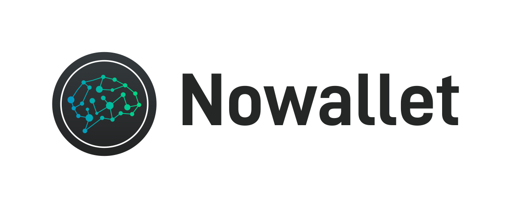

<h1 align=center>

</h1>

### Secure, private, and plausibly deniable
#### Cross-platform Bitcoin brainwallet

### Introduction:
This project is a secure Bitcoin brainwallet app that will ultimately be 
meant for desktop and mobile platforms. It was inspired by reports of 
incidents of Bitcoin being seized physically at border crossings. 
People need an option for a brainwallet that is secure and easy to use.

It's written in Python and depends on the pycoin and connectrum 
libraries. It uses Electrum servers on the back end, and communicates 
exclusively over Tor. It uses a variant of the ['WarpWallet'](https://keybase.io/warp/)
technique, combining PBKDF2 and scrypt with a salt for key derivation,
rather than the typical, highly insecure SHA256(passphrase) method that
your average brainwallet uses. Here's a basic explanation of the benefits
of using the WarpWallet technique:

##### Quoted from https://keybase.io/warp/:
>"WarpWallet is a deterministic bitcoin address generator. You never have 
>to save or store your private key anywhere. Just pick a really good 
>password  and never use it for anything else.
>
>This is not an original idea. bitaddress.org's brainwallet is our 
>inspiration.
>
>WarpWallet adds two improvements: (1) WarpWallet uses scrypt to make 
>address generation both memory and time-intensive. And (2) you can "salt" 
>your passphrase with your email address. Though salting is optional, we 
>recommend it. Any attacker of WarpWallet addresses would have to target 
>you individually, rather than netting you in a wider, generic sweep. And 
>your email is trivial to remember, so why not?"

(Note: Salting is not optional in our case.)

### Details:
Basically, you get a secure brainwallet in a convenient app (now with 
SegWit address support) and only need to remember an email address/password
combination rather than an entire 12/24 word seed. People are typically 
more accustomed to remembering a normal set of login info, which will 
protect users from forgetting or misremembering part of their seed and 
losing coins forever.

We have also implemented a full HD wallet compatible with BIP32/44. The 
current working title is Nowallet, as in, "I'm sorry officer, I have no 
wallet!"  We are currently in a pre-alpha state. All testers must be 
able to install dependencies and run from the simple command line interface.

If you're interested in testing, you can get some testnet coins here:
https://coinfaucet.eu/en/btc-testnet/

### SCREENSHOTS:

### REQUIREMENTS:
1. Building is currently supported on Linux based systems only. (Ubuntu LTS specifically if using Kivy)
2. Install Tor for Linux using the instructions linked below:  
https://www.torproject.org/docs/debian.html.en  
(Do not use the packages in Ubuntu's universe.)

### INSTALLATION:
Install Nowallet dependencies:  
`sudo apt-get install git python3-dev python3-pip libssl-dev`
  
Install Kivy UI dependencies: (optional)  
`sudo apt-get install build-essential ffmpeg libsdl2-dev libsdl2-image-dev libsdl2-mixer-dev libsdl2-ttf-dev libportmidi-dev libswscale-dev libavformat-dev libavcodec-dev zlib1g-dev`
  
Clone the Nowallet Github repository:  
`git clone https://github.com/metamarcdw/nowallet.git`  
  
Create a virtualenv (using virtualenvwrapper for example):  
First install virtualenvwrapper using the instructions linked below:  
http://railslide.io/virtualenvwrapper-python3.html  
Create the virtualenv:  
`mkvirtualenv --no-site-packages -p /usr/bin/python3 nowallet`  
  
Make sure Pip, Virtualenv and Setuptools are updated:  
`pip install --upgrade pip virtualenv setuptools`
  
Install required Python libraries:  
`cd nowallet`  
`make init`  
`make install`  
  
Install required Kivy libraries: (optional)  
`pip install Cython==0.24`  
`make init-kivy`  
`garden install qrcode`

Install required development libraries: (optional)  
`make init-dev`

Run nowallet from the command line:  
`make go`  
OR  
`make go-spend`  
OR  
`make go-kivy`  

#### UNIT TESTING:
Run unit tests (Must install dev libs):  
`make test`  
